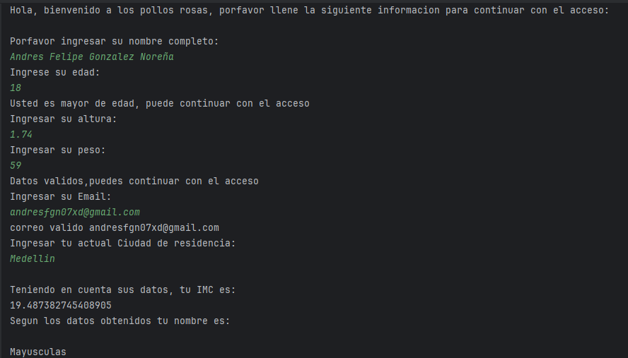
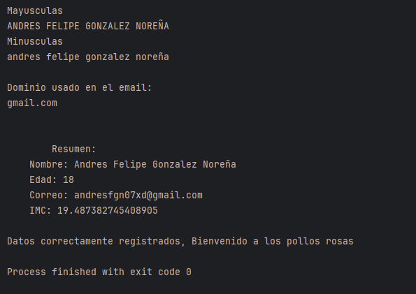

#Este es un programa el cual simula como deberia de ser un registro o un acceso en este caso a un local llamado: 
"los pollos rosas"

Cuando ejecutas el codigo te pedira ciertos datos los cuales tu llenaras, al final te dara un leve resumen de los datos ingresados
y si todo es correcto te dara un mensaje de bienvenida a "los pollos rosas"

Funcionalidades implementadas
Solicitud de datos personales: nombre, edad, correo, altura y peso.

Validación de correo electrónico (debe contener @ y .).

Validación de valores numéricos (altura y peso no negativos).

Cálculo del IMC (Índice de Masa Corporal).

Formateo del nombre completo en mayúsculas y minúsculas.

Extracción del dominio del correo electrónico.

Resumen de usuario con uso de string templates.

Repetición del programa para permitir múltiples registros sin cerrar el programa.

Almacenamiento de usuarios registrados en una lista temporal.

Retos:
no vi mucho reto ya que era algo basico asi que no vi mucha complejidad, solo que tuve que buscar variables extras para poder usarlas
como el trimIncident o tambien el subStringAfter pero de resto me parecio bastante facil